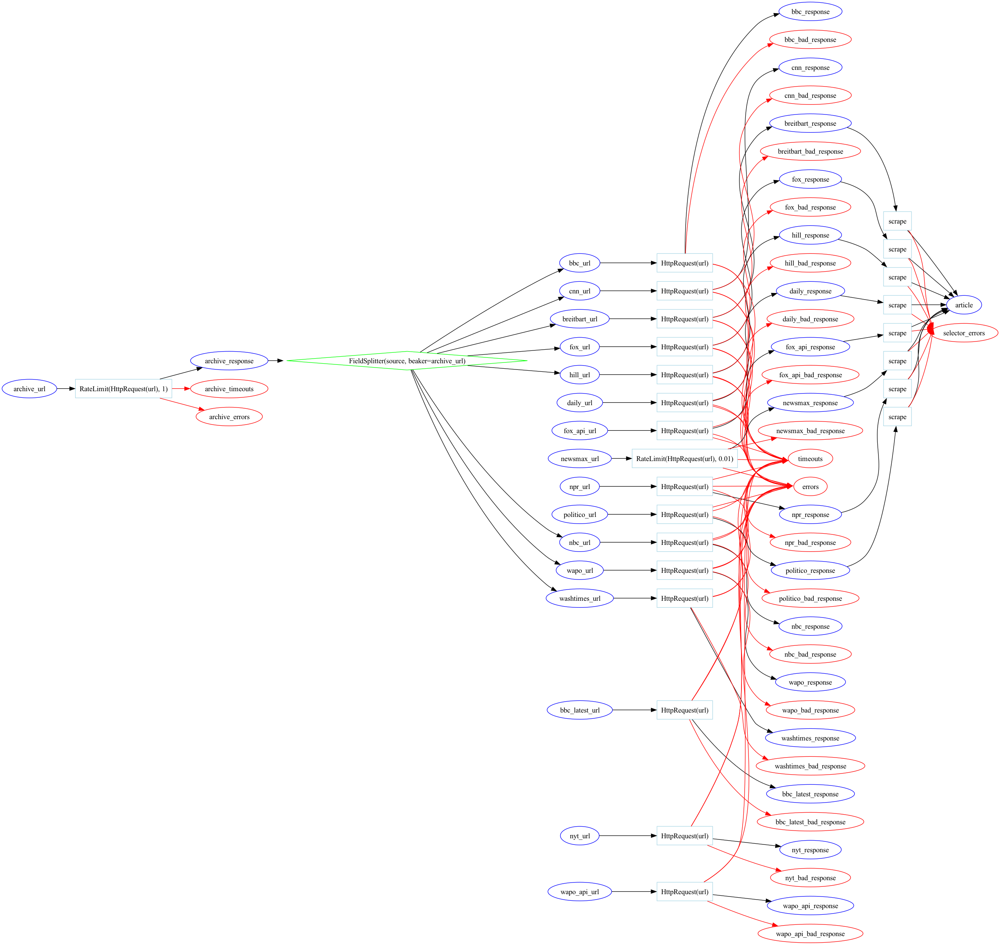

# newsfaces

## Usage

### Helpful Commands

`bkr show` to see the current state of the database.

### 1. Seeds

To work on a particular source, you'll need to start by running a seed
to get some initial data.

`bkr seeds` will list all the available seeds.

`bkr seed <seed_name>` will run the seed.

For test purposes, it is useful to run `bkr seed <seed_name> -rn 100`

* -r resets the seed first, useful for testing
* -n <number> will limit the number of records created, allowing you to test with a smaller dataset

### 2a. Running an archive-based crawl

Archive-based crawlers:

* bbc_archive
* cnn
* fox
* nbc
* wapo
* breitbart
* hill
* washtimes

These crawlers populate `archive_url`.

`bkr run --only archive_url` will process all archive_urls (converting them to archive_responses).

`bkr run --only archive_response` will process all archive_responses (converting them to <source>_urls).

Tip: Run `bkr show -w` in another terminal to see the database update in real time.

Tip: You can run both of these at once by passing `--only archive_url --only archive_response`.

### 2b. Running extractors

If you are using a non-archive-based crawler, the seed populated a beaker called <source>_urls.

If you are using an archive-based crawler, step 2a will have populated a beaker called <source>_urls.

`bkr run --only <source>_url` will process all <source>_urls (converting them to <source>_responses).

`bkr run --only <source>_response` will process all <source>_responses (converting them to articles).

## What Code Is Where?

By running the code with the `--only` flag, you can limit the pipeline to a single step.  This is useful for debugging, since in a full pipeline run it can be hard to tell where a problem is occurring.

Here's a quick guide to what code is run at each step:

(**Note**: The base class is listed, but subclass overrides would be used if present.)

**Archive Seeds** - `ArchiveCrawler.get_wayback_urls() -> Generator[ArchiveURL]`

**`archive_response` -> `source_url`** - `ArchiveCrawler.get_article_urls(HttpResponse) -> Generator[ArticleURL]`

**`source_response` -> `article`** - `Extractor.scrape(HttpResponse) -> Article`

So, for example, if you are running `bkr run --only archive_response`, you are running the `get_article_urls` method of the `ArchiveCrawler` class. The input is an already-fetched `HttpResponse` object, and the output is a `Generator` of `ArticleURL` objects.

## Images

